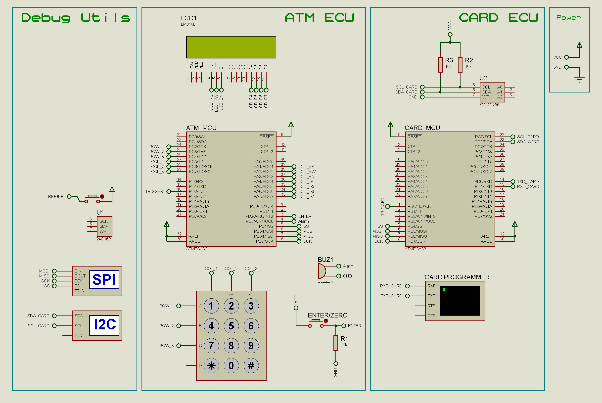

# Simple ATM Machine
#### Embedded Systems - Level 1
#### Author: Team 1 - Hacker Kermit
- #### Members:
    - Mahmoud Mowafey
    - Abdelrahman Walaa
    - Hossam Elwahsh
    - Tarek Elgohary

## Brief
> Design and implement a simple ATM machine to handle simple flows of a transaction. (Embedded C - ATmega32)

## Quick Links
> - `Project Documentation`
    >     👉 [PDF - uploading]()
    >     👉 [Google Docs](https://docs.google.com/document/d/1Tz5IJziaRbRw-O9JCpY1Yb374tjboJ_zGpGwjSU8gU4/edit?usp=sharing)
> - `Video` 👉 [Intro](Documents/Videos/Parts/0.%20Intro.mp4) (rest is uploading)
> - `Team Backlog` 👉 [Google Sheets](https://docs.google.com/spreadsheets/d/1ozed9YwEV6k1paEu0mNiVpEEqcUQBBLoRsS8NCEPoLg/edit?usp=sharing) 👉 [Excel](Documents/Hacker%20Kermit%20-%20Team%20Backlog%20Simple%20ATM%20Machine.xlsx)
> - `Test Protocol` 👉 [Google Sheets](https://docs.google.com/spreadsheets/d/1ozed9YwEV6k1paEu0mNiVpEEqcUQBBLoRsS8NCEPoLg/edit?usp=sharing#gid=320715025) 👉 [Excel](Documents/Hacker%20Kermit%20-%20Test%20Protocol%20Simple%20ATM%20Machine.xlsx)
> - ---
> ### Technical
> - `Proteus Simulation (Proteus 8.13)` 👉 [Simulation_8.13](Simulation/Simple_ATM_Machine.pdsprj)
> #### for older proteus version you can import the proteus clip file (pdsclip) and update the MC hex file:
> - `Proteus clip file` 👉 [Proteus PDSCLIP](Simulation/Clip_Simple_ATM_Machine.pdsclip)
> - `ATM ECU Hex` 👉 [ATM_ECU.hex](Simulation/hex/ATM_ECU.hex)
> - `CARD ECU Hex` 👉 [CARD_ECU.hex](Simulation/hex/CARD_ECU.hex)

---------

## Circuit Schematic

## Layered Architecture

